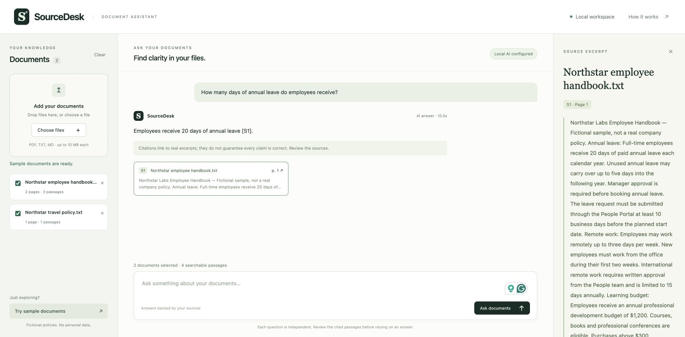
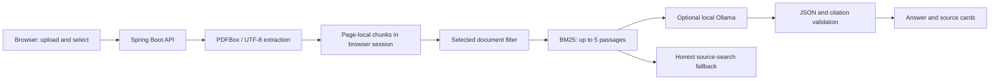

# SourceDesk

[Source code](https://github.com/zjh47981026/sourcedesk) · [Sample showcase](https://sourcedesk-jiahao.zjh479810262.chatgpt.site)

The hosted showcase uses predefined fictional examples; it accepts no uploads and runs no model. The full AI app runs locally.

A document assistant built with Java and Spring Boot. Upload a text-based PDF, TXT or Markdown file, select the documents to search, ask a question, and inspect the source excerpts behind the response.



## What works today

- PDF extraction with physical page numbers preserved; strict UTF-8 TXT/Markdown ingestion.
- Overlapping, page-local chunks and BM25 ranking, scoped to selected documents **before** retrieval.
- Optional local Ollama generation, with structured answers and server-owned citation metadata.
- Validation of citation labels and inline references; invalid output falls back to clearly labeled source search.
- In-memory browser-session workspaces, duplicate detection, deletion and fictional demo documents.
- Responsive interface, keyboard question submission, readable citation cards and source excerpt drawer.
- Loopback-only web/model endpoints, Host/Origin checks, restrictive CSP and plain-text rendering.

This first release uses lexical retrieval, not embeddings. With no model configured, it shows matching passages and does **not** claim to generate AI answers.

## Run the packaged application

Requires Java 17–25. The included build was tested with Java 25.

```sh
bash start-local.command
```

On macOS, double-click start-local.command or run it in a terminal. The original delivery can use its adjacent downloaded Ollama runtime; a fresh GitHub clone requires installing Ollama and pulling qwen3:4b first.

Open http://127.0.0.1:8787 and click **Try sample documents**. The samples describe a fictional company's leave, learning and travel policies; no personal files are included.

The executable JAR is in `target/sourcedesk-0.1.0.jar` in the local delivery. `target/` is intentionally excluded from version control. Stop the server with Ctrl+C. To build from source, install Maven 3.6.3+ and run:

```sh
mvn test package
bash start-local.command
```

## Enable generated answers

Install Ollama from its official website, and choose a locally running model suitable for your machine. For example:

```sh
ollama pull qwen3:4b
OLLAMA_NO_CLOUD=1 ollama serve
```

If Ollama is already running, configure its service with cloud features disabled rather than starting a competing service. In another terminal:

```sh
OLLAMA_MODEL=qwen3:4b bash start-local.command
```

Model downloads require network access and disk space. The runtime sends selected excerpts to a loopback Ollama endpoint; configuring a local endpoint alone cannot guarantee the Ollama service will never use cloud features. Use a downloaded local model with cloud features disabled. Known `-cloud` model names are rejected.

The local delivery uses Ollama 0.35.1 and a downloaded qwen3:4b model. The final live evaluation passed 22/24 fixture checks (12 cases run twice). Both failures were false abstentions on a supported parental-leave question. Actual responses are in evaluation/results.json. This small evaluation is not a general accuracy or security benchmark. Safari ChatGPT Pro reviewed the design; Ollama is the inference provider.

Optional environment variables:

| Variable | Default | Purpose |
| --- | --- | --- |
| `PORT` | `8787` | Local web port |
| `OLLAMA_URL` | `http://127.0.0.1:11434` | Local HTTP inference endpoint |
| `OLLAMA_MODEL` | empty | Exact installed local model name |

## Architecture



No document tool execution, remote assets, analytics, API keys or database are required. Questions are independent; previous chat messages are not sent to the model.

### API

| Method and route | Purpose |
| --- | --- |
| `GET /api/status` | Configuration state; does not claim model availability |
| `GET /api/documents` | Current session's document summaries |
| `POST /api/documents` | Multipart upload, field `file` |
| `POST /api/demo` | Load fictional examples idempotently |
| `DELETE /api/documents/{id}` | Remove a document and its chunks |
| `DELETE /api/documents` | Clear the workspace |
| `POST /api/ask` | JSON `{ "question": "...", "documentIds": ["..."] }` |

Answer states: `ai`, `source_search`, `no_evidence`. Sources contain a request-local label, document ID, filename, physical page number and canonical extracted excerpt. A source card opens the excerpt, not an original-PDF viewer.

## Validation

19 automated JUnit tests cover real two-page PDF extraction, unreadable PDFs, invalid upload formats/encoding, workspace limits, duplicate/re-upload behavior, session isolation, selection-scoped retrieval, absent evidence, honest fallback, endpoint restrictions, successful model output and invalid/unsupported citations. Model responses are deterministic test doubles, not a measure of real LLM quality.

Manual browser verification covers sample loading, asking a question and opening its cited passage. See `VALIDATION.md` for the recorded checks.

## Deliberate limits

- Up to 20 documents per browser session; 10 MB per file, 100 PDF pages, 250,000 extracted characters per document, 1,500 question characters.
- Data is temporary. Session expiry (60 minutes of inactivity), a lost session cookie or server restart loses the workspace. PDF upload handling may use temporary files managed by the web server; no original file is retained by the application.
- Scanned PDFs require external OCR. Complex layouts/tables may extract in a misleading order. Printed page labels may differ from physical PDF page numbers. TXT/MD sources use page 1.
- BM25 uses lexical terms and English stopwords. Paraphrases can miss relevant evidence; results are not confidence scores. A top-five context does not establish exhaustive document coverage.
- Citation checks validate references, **not semantic support**. A model may still misunderstand, omit exceptions, mishandle conflicting documents or follow a prompt injection. The UI asks users to inspect evidence. No tools are exposed to the model.
- Local demo, not production hosting: no authentication, durable storage, multi-user authorization, malware scanner, parser sandbox, PDF extraction deadline or robust global resource quotas. Session separation is not protection from other processes/users on the machine. Do not expose this server publicly or upload confidential workplace material without authorization.
- The real-model evaluation found false abstentions; broader answer-quality and resource evaluation remains future work. Do not claim universal hallucination prevention, production security or benchmark numbers.

## Portfolio discussion

The project demonstrates Java API design, bounded ingestion, retrieval scoping, graceful provider failure, source provenance and testable AI contracts. It was developed with AI assistance, including Muse architecture/UX reviews and a ChatGPT Pro design critique. An owner should understand and be able to explain the code and these tradeoffs before presenting it in interviews.

Possible next steps: a broader labeled answer-quality dataset, hybrid retrieval, persistence, a PDF viewer and measured performance. These are roadmap items, not current features.
